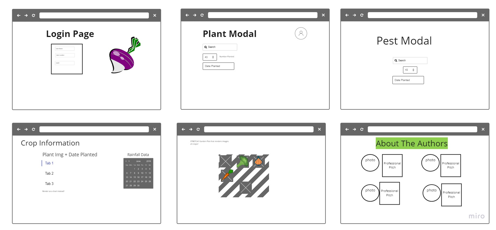
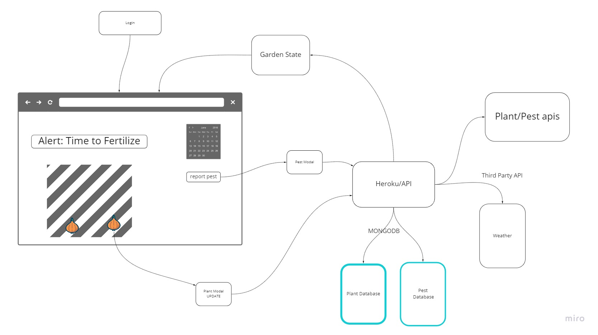
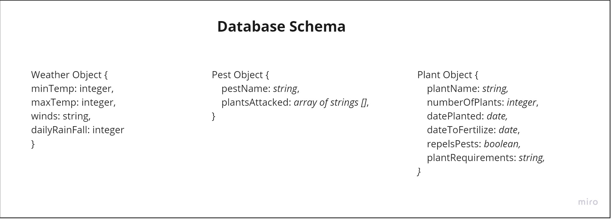

# Garden-Front-End

## Group Project: Team Agreement
- Josh Huston
- Ian Cargill
- Osborn Del Angel
- Jeff Inman

## Links
- [Project Trello](https://trello.com/invite/b/sXwmzOw8/a49b55eb66dad186da8b889bf58038f3/the-garden-app) 

## Planning
Schedule a 1-hour meeting for your entire project team.
Use this time to review the Team Agreement requirements below, and establish consensus on how to handle each requirement.
Deliverable
Start a public-facing GitHub markdown file, and include the following components in your team agreement submission.
Cooperation Plan
Every person on your team is an asset. This is your chance to discover the hidden strengths and areas for growth for each team member.

Describe at least:
### What are the key strengths of each person on the team?
Jeff – Organization
Ian – API, Deployment
Osborn – Committed, and persistent
Josh – Debugging, REACT Components

### How can you best utilize these strengths in the execution of your project?
-	Use everyone’s strengths to assign appropriate roles that play to each team members strengths, as we are breaking out roles.

### In which professional competencies do you each want to develop greater strength?
-	Critical Thinking and Creative Problem Solving
-	Teamwork and Collaboration

### Knowing that every person in your team needs to understand all aspects of the project, how do you plan to approach the day-to-day work?
-	We will utilize project management tools like Trello, and complete cards similar to labs to create a backlog to effectively communicate elements of the project
-	Write down the pieces of the projects in as simple terms as possible
-	Have check-in meetings to ensure that the connecting pieces appropriately, check merge conflicts
-	Work on appropriate branches throughout the project

## Conflict Plan
Your team should agree on a process for handing disagreements, should they arise. It is better to have a plan in place ahead of time so you can all refer back to it when necessary.

Describe at least:
### What will be your group’s process to resolve conflict, when it arises?
-	Foster an open dialogue, so members feel free to communicate concerns as they arise.
### What will your team do if one person is taking over the project and not letting the other members contribute?
-	Keep work load segmented
-	Utilize check-in meetings to cross-load workload and ensure no one member is over utilized or otherwise.
### How will you approach each other and the challenges of the project knowing that it is impossible for all members to be at the exact same place in understanding and skill level?
-	Make assignments that appropriate to each members skill/ comfort level
-	Coach through stretch components/ modules as they arise.
### How will you raise concerns to members who are not adequately contributing?
-	Utilize check-in meetings to cross-load workload and ensure no one member is underutilized, as well as over utilized.
### How and when will you escalate the conflict if your resolution attempts are unsuccessful?
-	Raise our concerns to JP, if the conflict cannot be handled at the lowest level

Communication Plan
Before beginning to tackle the project, determine how your group will communicate with each other. This is not an individual effort. Make sure everyone feels comfortable with the identified methods of speaking up.

Describe at least:

### What hours will you be available to communicate?
-	Class time during the week (630-930pm)
### What platforms will you use to communicate (ie. Slack, phone …)?
-	Slack for intermittent communication
### How often will you take breaks?
-	Every hour, at a minimum – 15 min rule for stuck moments
### What is your plan if you start to fall behind?
-	Utilize communication to get to MVP
-	Get a logical MVP and then utilize the larger goals/planning for stretch goals
### How will you communicate after hours and on the weekend?
-	Slack for intermittent communication, as available
### What is your strategy for ensuring everyone’s voice is heard?
-	Daily Check-in Meetings
### How will you ensure that you are creating a safe environment where everyone feels comfortable speaking up?
-	Open communication

## Work Plan
Explain your work plan to track whether everyone is contributing equally to all parts of the project, and that each person is working on “meaty” problems. This should prevent “lone wolf” efforts and “siloed” efforts.

Describe at least:

### How you will identify tasks, assign tasks, know when they are complete, and manage work in general?
### What project management tool will be used?
### Git Process
-	As described above, we will utilize Trello cards and workflow to ensure that we create a backflow to delegate tasks during the daily stand-up meetings.
-	Once we have reached an appropriate benchmark we will convene and push our products to the main branch.
Plan out what your team’s Git workflow looks like for coding tasks.

Describe at least:
### What components of your project will live on GitHub?
-	All of our links, deployed links, repos, etc.. will be stored on our project README.md.
### How will you share the repository with your teammates?
-	Github Organization – store our repo inside that and assign all members as collaborators.
### What is your Git flow?
-	Main Branch =>> Dev Branch (testing updating) => Individual task branches
### Will you be using a PR review workflow? If so, consider:
2 people for push from individual Branches to Dev
### How many people must review a PR?
Team approval for Dev => Main
### Who merges PRs?
### How often will you merge?
### How will you communicate that it’s time to merge?
-	**In development** Branches will all be created, and the first individual task branch created will call the team together and we will do a crawl phase walk through of the merge procedure to ensure we are all on the same page for this step.

## Submitting Your Work
This is a group submission. Only one person must submit for group credit.

Please have everyone’s name at the top of the doc.

Submit a link to the GitHub markdown file where you have created your Team Agreement.

This step must be completed and approved before proceeding with any project work. Notify your instructor when this is ready for review.

# Prepare for Projects
Project Requirements
Your instructor will provide the detailed requirements for your project, and team tasks.
Group Project: Pitch Ideas
It is now time to begin preparations for your Group Project. You’ve been given groups, so the first step for group projects is to pitch ideas.
Tasks
As a group, arrange a 30-60 minute time when you can all be in the same place. Lab time is ideal for this.
There will be two phases for this: brainstorm ideas, and pitching projects.
Brainstorming Ideas
Grab a whiteboard and brainstorm ideas. During this phase, there is no comment or criticism of ideas. Ideas should be given in the form of titles or very short phrases. If an explanation is needed, save it for the pitch round.
Pitching a Project
Once a critical mass of ideas has been written down, the person who offered the idea will give a pitch. Each pitch may be no longer than 2 to 3 minutes. The purpose of a pitch is to sell the idea to your group mates. During this phase, questions may be asked, but the discussion should be limited. Keep it short and to the point.
At the end of the pitch, you should have formed a short list of favorites.

Restaurant Locator
Garden App
Tinder for restaurants

Create your Pitch
Once your team had decided on 1 or 2 favorites, prepare your pitches for submission.
Each pitch should contain the following information:
Garden Working Title
1.	Summary of idea.
•	Garden tracking app
2.	What problem or pain point does it solve? a. Keep it high level without going into too much detail. (3-4 sentences is enough)
    - Easy data collection for home gardeners
    - Crop rotation/ pests/ weather trends and issue tracking

3. Minimum Viable Product (MVP) definition.
### What is the minimum required for you to present on your demo day?
-	User Interface – plot out garden
-	Entering and storing data (plants, pests, etc.)
-	Database connections – weather, and plants
-	Mongo connection for data storage
-	Really cute picture of a carrot, possibly a turnip.

### Additional Stretch Goals:
Garden App - Garden tracking app.  Identify your garden bed location (maybe with HTML Canvas to draw your beds), add information /dates for when items were planted.  Measure Rainfall / watering/ and pest activity.  Look back on crop rotation and pests for different time of year and weather specific to your garden. Needs: Plant API, Weather API, (maybe a pest/insect API) and several data Schemas for Plants and pests.
Click on a bed, add a plant / harvest / remove / report pests / schedule watering...

- Need to keep the scope small
- Canvas layout should be a stretch

Restaurant Locator
1.	Summary of idea.
•	User will type in the city they want, and some restaurants will show up. They can save, favorite, add, and delete using their google account and auth o.
•	
2.	What problem or pain point does it solve? a. Keep it high level without going into too much detail. (3-4 sentences is enough)
•	User can type in the city they will be going to and it will provide the type of food options the user has saved.
3.	Minimum Viable Product (MVP) definition.
•	What is the minimum required for you to present on your demo day?
1.	Similar to city explorer but the users’ choices will filter out the restaurant types and dishes they have saved – utilizing their google sign in and preferences.

### Submitting your work
Only one person needs to submit this assignment for the group to receive credit, please include all names of group members in your pitch document.
As a group, agree on 2 top ideas. In a doc, or in the text area submit your top two pitches. The instructional staff will then approve one of your two ideas. Please have your top choice listed first, and second choice listed last.

### Wire Frame

### Domain Model

### Database Schema

